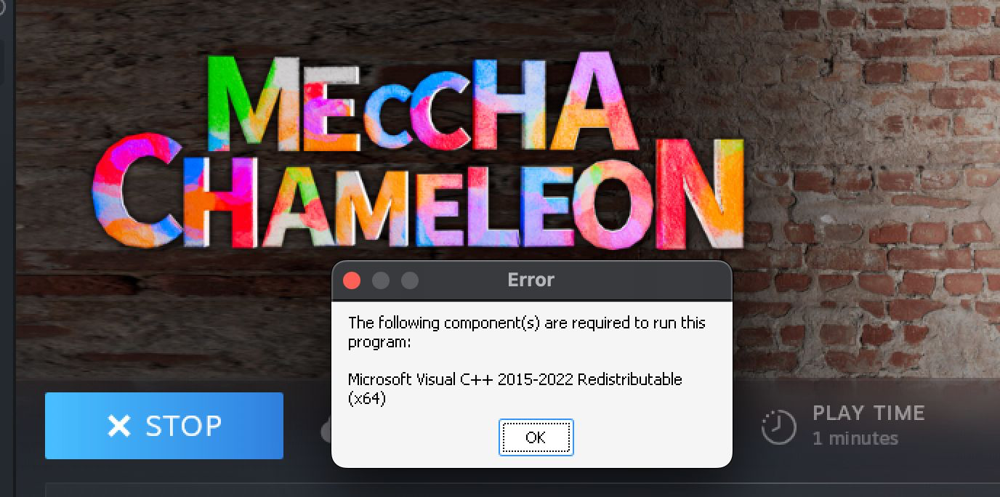
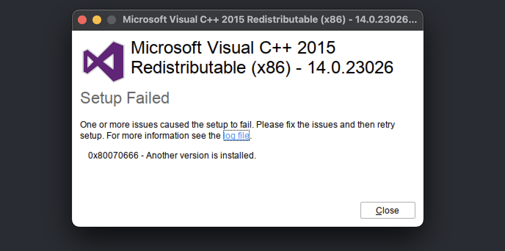
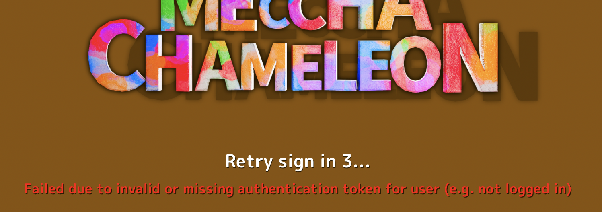

# MECCHA CHAMELEON on macOS with CrossOver

A persistent fix for these two launch failures:

1. **Microsoft Visual C++ 2015–2022 Redistributable (x64) is required**
2. **Invalid or missing authentication token**

The important detail is that these are separate problems:

- The Steam bottle needs the current **x64** Visual C++ runtime.
- The game must start through **Steam**, even when bypassing its broken prerequisite launcher, so Steam can supply the authentication token.

## Tested configuration

| Component | Tested value |
| --- | --- |
| CrossOver | 26.3.0 |
| Bottle | Windows 10 bottle named Steam |
| Game | MECCHA CHAMELEON |
| Steam App ID | 4704690 |
| Visual C++ runtime | 2015–2022 x64, version 14.51.36247 |
| Test date | 2026-08-31 |

## Symptoms

### Missing x64 runtime

### Old x86 installer reports that another version is installed

Error 0x80070666 usually means a newer compatible x86 runtime is already installed. Do not remove or downgrade it just to satisfy the old installer.

### Direct executable starts, but authentication fails

This happens when PenguinHotel-Win64-Shipping.exe is launched directly without Steam's launch context.

## Correct persistent fix

### Step 1 — Stop the Steam bottle

1. Open CrossOver.
2. Select the **Steam** bottle.
3. Click **Quit All Applications**.
4. If CrossOver changes the button to **Force Quit**, wait briefly and use it only if Steam does not close.

Steam must be stopped before changing its configuration manually.

### Step 2 — Install or repair the current x64 Visual C++ runtime

1. Download the current Microsoft Visual C++ 2015–2022 x64 redistributable:

   https://aka.ms/vc14/vc_redist.x64.exe

2. In CrossOver, select the **Steam** bottle.
3. Click **Run Command**.
4. Click **Browse** and select vc_redist.x64.exe.
5. Run it with these options:

~~~text
/install /passive /norestart
~~~

6. If the installer offers **Repair**, choose it.
7. Let the installer finish, then simulate a bottle reboot or restart CrossOver.

Important:

- Install the runtime inside the same bottle that contains Steam and the game.
- Use the x64 installer. The game executable is 64-bit.
- Error 0x80070666 from an old x86 installer is not evidence that x64 is missing.
- Copying DLL files alone is not sufficient; the redistributable must also be registered in the bottle.

### Step 3 — Add the Steam launch override

1. Start **Steam** from the CrossOver Steam bottle.
2. Open **Library**.
3. Right-click **MECCHA CHAMELEON** and select **Properties**.
4. On the **General** page, find **Launch Options**.
5. Paste this exact line:

~~~text
"C:\Program Files (x86)\Steam\steamapps\common\MECCHA CHAMELEON\Chameleon\Binaries\Win64\PenguinHotel-Win64-Shipping.exe" %command%
~~~

6. Close the Properties window.
7. Exit Steam cleanly once so it saves the option.

Why this works:

- The replacement executable bypasses the prerequisite stub that incorrectly reports the x64 runtime as missing.
- The trailing %command% preserves Steam's original launch command and authentication context.

### Step 4 — Launch normally

Start the game using either:

- Steam's **Play** button, or
- the normal **MECCHA CHAMELEON** launcher in CrossOver.

Do **not** use a standalone CrossOver launcher named PenguinHotel-Win64-Shipping. A direct launch bypasses Steam and produces the missing-authentication-token error.

## Validation

A successful launch should meet all of these checks:

1. No Visual C++ prerequisite dialog appears.
2. No invalid-or-missing-authentication-token message appears.
3. The game reaches its signed-in profile or main menu.
4. The running command contains both the shipping executable and the original Steam command.

Optional macOS Terminal check:

~~~sh
ps ax -o command= | grep -F "PenguinHotel-Win64-Shipping.exe"
~~~

Expected shape:

~~~text
...\PenguinHotel-Win64-Shipping.exe ...\PenguinHotel.exe
~~~

The second path confirms Steam applied the launch override rather than CrossOver starting the shipping executable by itself.

An authenticated run may also create or update an online-profile save under:

~~~text
C:\users\crossover\AppData\Local\Chameleon\Saved\SaveGames
~~~

## Manual configuration fallback

Use this only if Steam's Properties interface cannot save Launch Options.

1. Stop every application in the Steam bottle.
2. Locate:

~~~text
C:\Program Files (x86)\Steam\userdata\<Steam-account-ID>\config\localconfig.vdf
~~~

3. Find the game object under Steam's apps section:

~~~text
"4704690"
{
    ...
}
~~~

4. Add this value inside that object:

~~~text
"LaunchOptions"    "\"C:\\Program Files (x86)\\Steam\\steamapps\\common\\MECCHA CHAMELEON\\Chameleon\\Binaries\\Win64\\PenguinHotel-Win64-Shipping.exe\" %command%"
~~~

5. Save the file.
6. Start Steam, exit it cleanly, and confirm the LaunchOptions line remains.
7. Launch the normal MECCHA CHAMELEON shortcut.

If multiple Steam accounts have used the bottle, edit the userdata directory for the account currently signed in. Using Steam's Properties interface avoids selecting the wrong account directory.

## Troubleshooting

| Problem | Cause | Fix |
| --- | --- | --- |
| Visual C++ x64 dialog still appears | Runtime is absent, installed in another bottle, or only DLLs were copied | Install or repair vc_redist.x64.exe inside the Steam bottle |
| x86 installer returns 0x80070666 | A newer compatible x86 runtime is installed | Keep the newer version; do not downgrade |
| Invalid or missing authentication token | Shipping executable was started directly | Launch through Steam and keep %command% in Launch Options |
| Original prerequisite dialog returns | Launch Options were removed or saved under another Steam account | Reapply the option in the active account's game Properties |
| Launch Options disappear after a manual edit | Steam overwrote localconfig.vdf while running | Stop Steam before editing, then start and exit it cleanly |
| Game does not start after the override | Executable path is incorrect or game files changed | Verify game files in Steam and confirm the Win64 path |

## Undo

1. Open Steam.
2. Open MECCHA CHAMELEON **Properties**.
3. Clear **Launch Options**.
4. Exit Steam cleanly.

The Visual C++ runtime can remain installed because other Windows applications may require it.

## Security notes

- The launch option contains no password, token, or account secret.
- Never publish Steam session files, cookies, login QR codes, or authentication logs.
- A private repository still deserves the same credential hygiene as a public repository.

## References

- [CodeWeavers compatibility entry for MECCHA CHAMELEON](https://www.codeweavers.com/compatibility/crossover/meccha-chameleon)
- [CodeWeavers community launch workaround](https://www.codeweavers.com/compatibility/crossover/tips/meccha-chameleon/launch-issues)
- [Microsoft: Latest supported Visual C++ redistributable downloads](https://learn.microsoft.com/en-us/cpp/windows/latest-supported-vc-redist)
